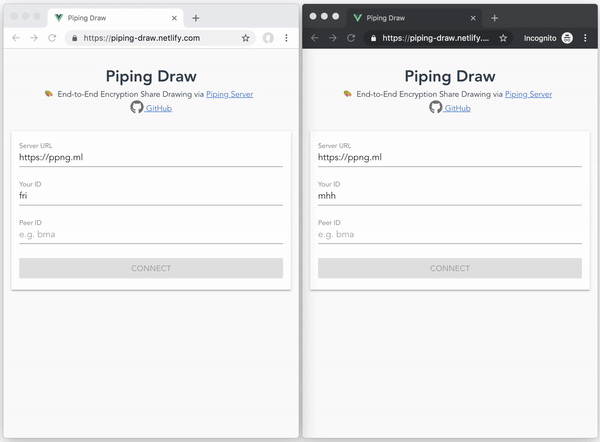

# piping-draw

End-to-End Encryption Share Drawing via [Piping Server](https://github.com/nwtgck/piping-server)

## Purpose & Features
The main purpose of Piping Draw allows users draw/write pictures/letters safely via Piping Server. It has the following features for the purpose.

* End-to-End Encryption by AES [GCM](https://en.wikipedia.org/wiki/Galois/Counter_Mode)
* Key exchange by [ECDH](https://en.wikipedia.org/wiki/Elliptic-curve_Diffie%E2%80%93Hellman)
* via [Piping Server](https://github.com/nwtgck/piping-server)
* Static hosting
* Progressive Web App (PWA)
* Accountless
